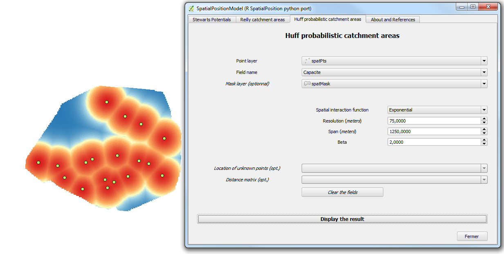

SpatialPositionModel
--------------------

Partial python port of R SpatialPosition package.
Original package (documentation and R source code) are available on [GitHub](https://github.com/Groupe-ElementR/SpatialPosition) or on the [CRAN](https://cran.r-project.org/web/packages/SpatialPosition/)

Three models are implemented :

**Stewart Potential**

**Reilly catchment areas**

**Huff probabilistic catchment areas**

