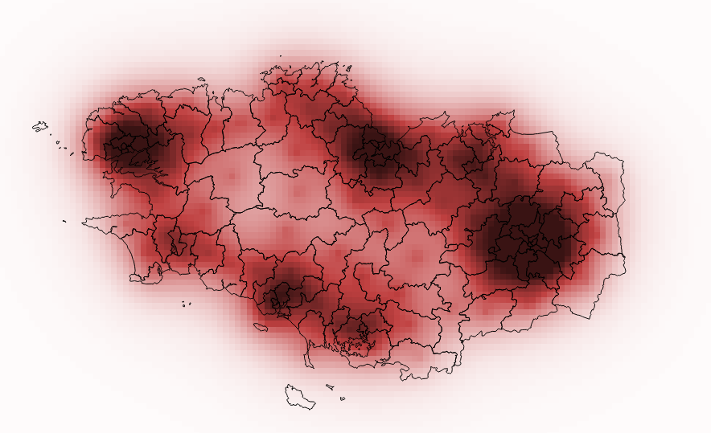

SpatialPositionModel
--------------------

Python port of "Stewart Potentials" method from [R SpatialPosition package](https://github.com/Groupe-ElementR/SpatialPosition) for [QGIS](http://qgis.org).
Original package (documentation and R source code) are available on [GitHub](https://github.com/Groupe-ElementR/SpatialPosition) or on the [CRAN](https://cran.r-project.org/web/packages/SpatialPosition/).  

If you are only interested in computing potentials and drawing contour but not in QGIS, take a look to the [smoomapy](https://pypi.python.org/pypi/smoomapy/) python package.

**Stewart Potentials**  




#### Installation :
This plugin hasn't been submitted on QGIS plugin repository yet.

To use it, download the latest release (https://github.com/mthh/SpatialPositionModel/releases) and extract it in your QGIS plugin folder (usually something like $USER/.qgis2/python/plugins).
Example on GNU/Linux :
```
wget https://github.com/mthh/SpatialPositionModel/releases/download/v0.1.0-alpha/SpatialPositionModel.zip
unzip SpatialPositionModel.zip -d /home/$USER/.qgis/python/plugins
```

The plugin is now installed and will be available to load in the plugin window of QGIS (think also to allow experimental plugins) under the name **SpatialPositionModel**.


To contribute, clone this repository and use the various rules from the Makefile:

```
git clone https://github.com/mthh/SpatialPositionModel.git
cd SpatialPositionModel
make deploy
```
