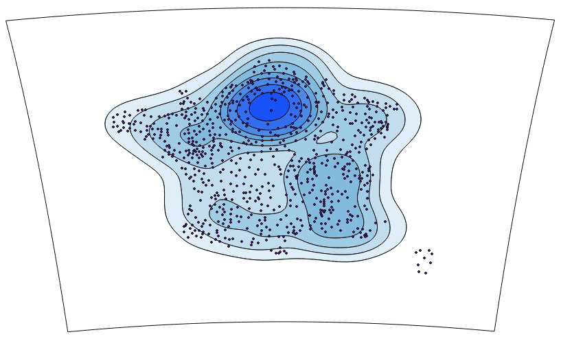

SpatialPositionModel
--------------------

python port of "Stewart Potentials" method from [R SpatialPosition package](https://github.com/Groupe-ElementR/SpatialPosition).
Original package (documentation and R source code) are available on [GitHub](https://github.com/Groupe-ElementR/SpatialPosition) or on the [CRAN](https://cran.r-project.org/web/packages/SpatialPosition/).


**Stewart Potentials**  



#### Installation :
This plugin hasn't been submitted on QGIS plugin repository yet.
It can be installed like this :
```
git clone https://github.com/mthh/SpatialPositionModel.git
cd SpatialPositionModel
make deploy
```

The plugin is now installed and will be available to load in the plugin window of QGIS (think also to allow experimental plugins) under the name **SpatialPositionModel**.
